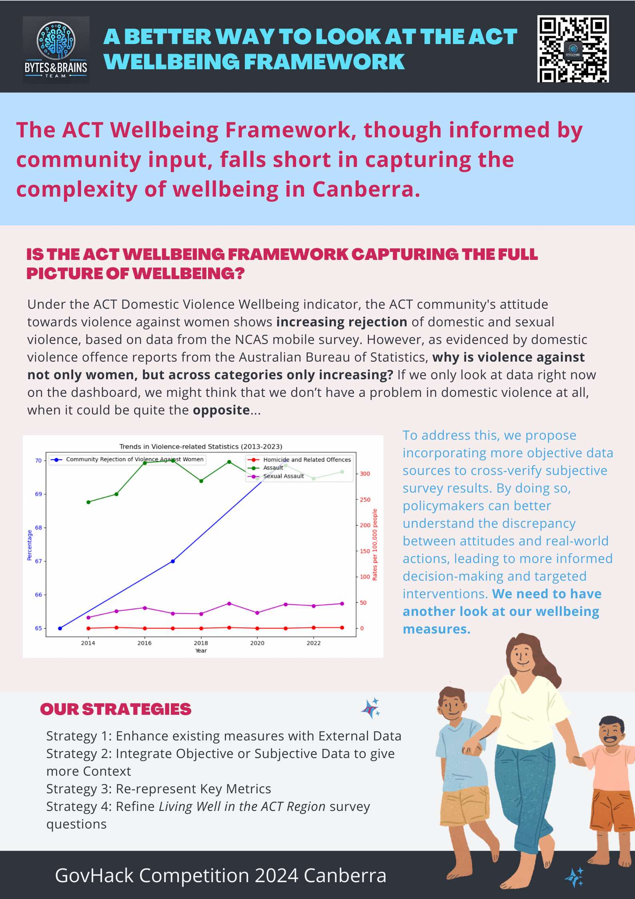

## Where does the  ACT wellbeing framework fall short?

The ACT Wellbeing Framework, based on input from nearly 3,000 Canberrans, aims to capture community priorities. However, the current data often lacks depth, failing to represent all communities or provide nuanced insights. As a result, wellbeing indicators may be misrepresented, offering an incomplete picture of Canberra's quality of life and limiting actionable insights for policymakers and service providers. 

## Refining the ACT Wellbeing Framework: Enhancing Accuracy and Representation

Our solution bridges data gaps in the ACT Wellbeing Framework by analyzing the relevance, context, and representativeness of the dashboard data. We propose key strategies, including refining survey questions, integrating external data sources, and re-representing existing data. This will ensure the indicators reflect the true experiences of diverse communities in Canberra, offering clearer insights for policymakers to make targeted, informed decisions.

#### [Sources](DataList.md)
